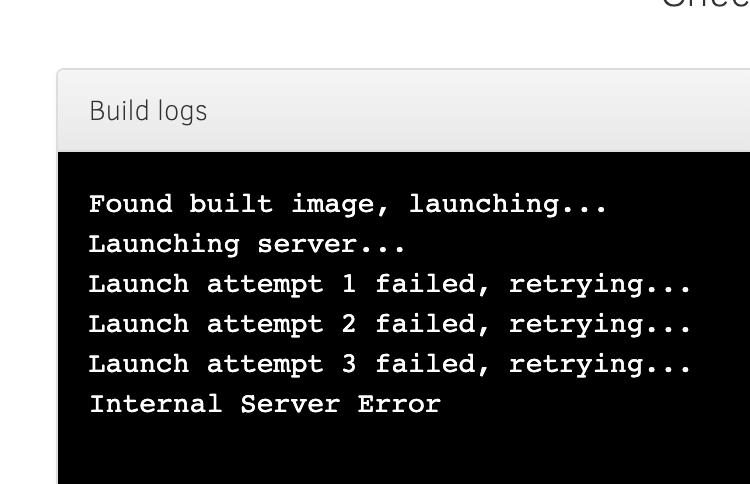

# Week 1: Notes

- No idea if we were supposed to read the intro to Jupyter notebooks but I'm reading it anyway for extra content
  - or not...

  
- Github
  - Nothing new here --> email Dr. Graham about single repo
  - Will reprise digihist website for coursework --> only consolidation documents + exit ticket
    - Maybe other things if I think they're neat

- Hypothes.is
  - Didn't make use of Hypothes.is in digihist at all
    - Find "pop up" annotation disruptive to my reading process
    - Constantly sidetracked by annotations --> fragmented absorption and hence understanding of article's contents
  - Would like to figure out a way to make Hypothes.is more ADHD friendly
    - Read first, then interact with the annotations others have written later?

- Zotero
  - Wonderful and have been using it for the past 2ish yrs
  - Sometimes it puts info in the wrong place
  - Bibliography tool doesn't always format correctly

- Discord
  - Fun community building platform
  - Increasingly being used in classes --> takes the scary level of formality out of academics

- Notable Quotes
  - "Digital archaeology of the 21st century is necessarily a public archaeology." -ODATE
  - "Discovery marks out the digital humanist whilst justification signals the humanist who uses computers." -ODATE
  - "This is perhaps the greatest flaw in transhuman and posthuman philosophies: the unflinching commitment to technology and science to evolve beyond human conflicts and limitations fails to protect humans now, risking the creation of greater fissures rather than making progress." -Inclusivity
  - "While there are a variety of ways to engage the public in the digital realm, to be successful in any part of the spectrum, archaeologists need to know their audience(s), know how they want to make an impact, and know how to measure it regardless of what size audience they are aiming to engage and how they hope to do it." -Co-Creation
